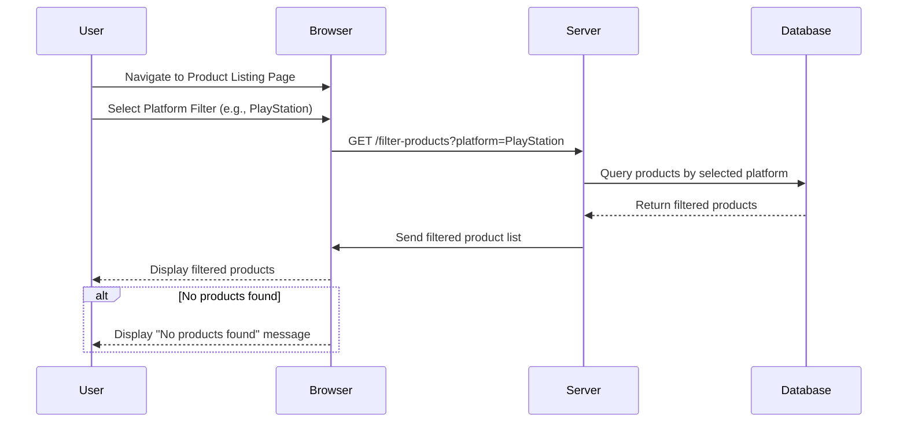

# User Story
**As a user**, I want to create a profile with my personal details (e.g., name, address, contact information) so that my information is stored in the system.

# Acceptance Criteria / Definition of Done (DoD)
1. **Form Validation:**
   - The profile creation form must validate user inputs, ensuring all required fields (e.g., name, address, contact information) are filled out correctly.
   - Validation should occur on both the client-side (browser) and server-side to prevent incorrect data submission.

2. **Profile Creation:**
   - Upon form submission, the system must process the profile creation request and securely store the user's personal details in the database.
   - Error handling must be in place to ensure the profile is created without issues.

3. **Confirmation Message:**
   - After successful profile creation, the user must receive a confirmation message indicating that their profile has been created.

4. **Database Entry:**
   - The user's personal details must be correctly stored in the database, without duplication or data loss.
   - The database entry must be retrievable and display accurate information when accessed.

5. **Accessibility:**
   - The newly created profile should be immediately accessible to the user, allowing them to view and confirm the accuracy of their details.

6. **Security:**
   - All personal data must be securely stored, with encryption applied where necessary.
   - Implement security checks to protect against SQL injection or other potential vulnerabilities.

7. **Code Review:**
   - The code must be reviewed by peers to ensure adherence to coding standards and best practices.

8. **Documentation:**
   - The profile creation process should be documented for future reference, including any API endpoints used, validation rules, and security measures.

# Mermaid Diagram

