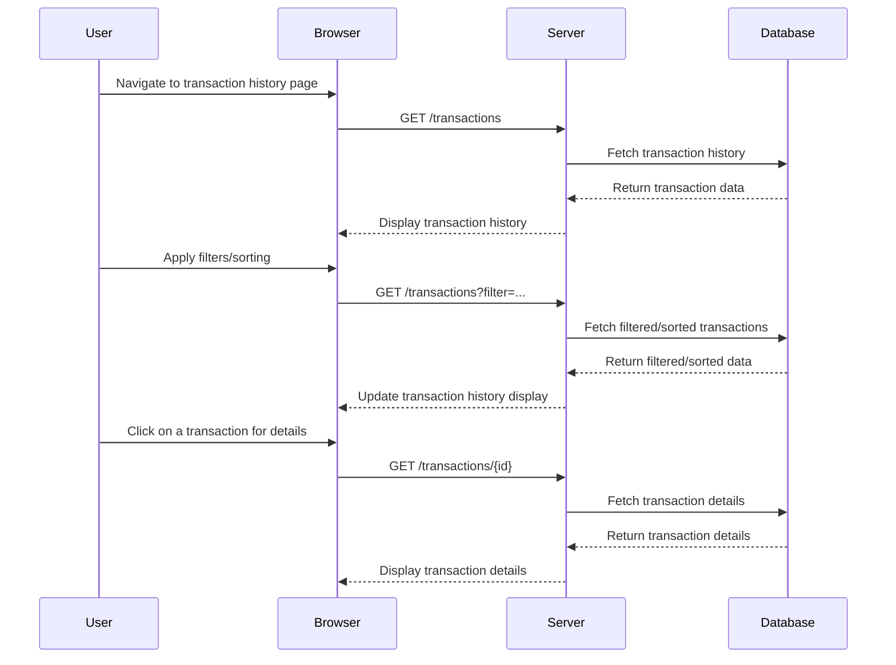

# User Story

**As a user**, I want to view a history of my transactions so that I can track my purchases and payments on the platform.

## Acceptance Criteria / Definition of Done (DoD):

1. **Transaction History Page:**
   - The transaction history page is accessible from the user’s account dashboard.
   - The page displays a list of all transactions, including:
     - Date of transaction
     - Transaction amount
     - Payment method (e.g., credit card, PayPal)
     - Transaction status (e.g., successful, pending, failed)
     - Transaction ID
   - Each transaction entry is clickable to view more detailed information.

2. **Filtering and Sorting:**
   - Users can filter transactions by:
     - Date range
     - Transaction status (e.g., successful, failed)
     - Payment method
   - Users can sort transactions by:
     - Date (newest to oldest, oldest to newest)
     - Amount (highest to lowest, lowest to highest)

3. **Detailed View:**
   - Clicking on a transaction opens a detailed view displaying:
     - Transaction ID
     - Date and time of transaction
     - Item(s) purchased
     - Amount paid
     - Payment method used
     - Transaction status
     - Any relevant notes (e.g., reason for failure if applicable)
   - The detailed view includes options to download or print a receipt.

4. **Responsiveness:**
   - The transaction history page is fully responsive and displays correctly on all screen sizes, including mobile devices.
   - The user experience remains smooth and intuitive on both desktop and mobile.

5. **Performance:**
   - Pagination is implemented for large transaction histories, with a default of 20 transactions per page.

6. **Security:**
   - User transaction history is secure and accessible only to the authenticated user.
   - All sensitive data (e.g., payment method) is displayed in a secure, non-exploitable format (e.g., masked credit card numbers).

# Mermaid Diagram

