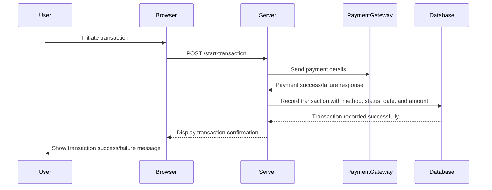

# User Story

**As a user**, I want the system to record my transactions, including payment method, status, and date, so that I can have a clear record of my financial activities.

## Acceptance Criteria / Definition of Done (DoD):

1. **Transaction Recording:**
   - Every transaction initiated by the user is automatically recorded in the system.
   - The system captures and stores the following details for each transaction:
     - Payment method (e.g., credit card, PayPal)
     - Transaction status (e.g., successful, pending, failed)
     - Date and time of the transaction
     - Transaction ID
     - Amount paid

2. **Data Integrity:**
   - The system ensures that no duplicate transactions are recorded.
   - Transaction data is consistently accurate and reflects the correct payment status.

3. **Failure Handling:**
   - If a transaction fails, the system records the failure reason and maintains a record of the attempt.
   - Users are notified immediately if a transaction fails, with the option to retry.

4. **Accessibility:**
   - The recorded transactions are accessible from the user’s account dashboard within 1 minute of completion.
   - Users can view their transaction history at any time with the data correctly reflecting the most recent transaction.

5. **Performance:**
   - The system can handle recording and storing up to 10,000 transactions per minute without performance degradation.
   - Transaction records are retrievable within 2 seconds when requested by the user.

## Sequence Diagram

