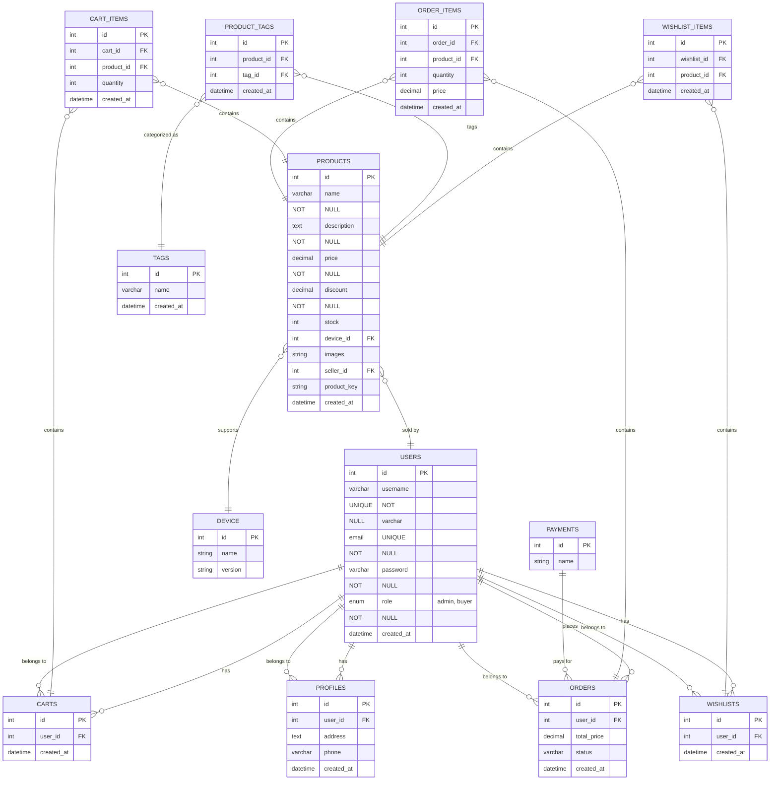

# ERD Documentation Structure

## 1. Online Game Voucher Database Schema
This database is designed to support the core functions of an online game voucher platform, including product, user, order, shopping cart and wishlist management.
The goal is to provide an efficient and scalable data structure that can support the various features required by users and administrators.

## 2. Diagram ERD

## 3. Entity Explanation
- **TABLE_NAME**: Description of the entity and its attributes.

## 4. Relation
- **Relationships between entities**: Description of the relation and cardinality.

## 5. Additional Notes
Additional relevant information.

